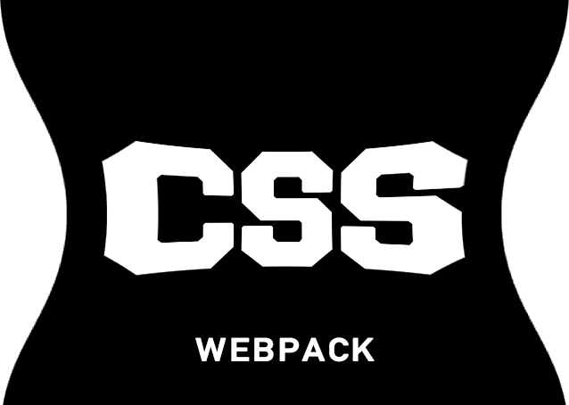
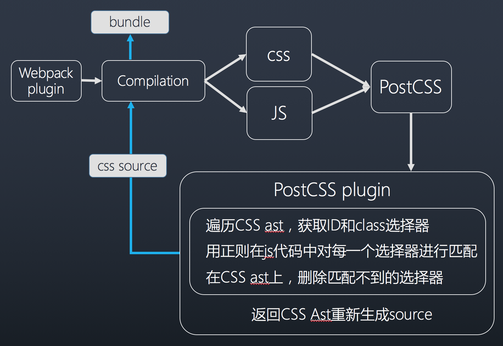

<p style="text-align: center">
  
</p>

# webpack-css-treeshaking-plugin

[](https://travis-ci.org/lin-xi/webpack-css-treeshaking-plugin)
[](https://coveralls.io/github/lin-xi/webpack-css-treeshaking-plugin?branch=master)
[](https://www.npmjs.org/package/webpack-css-treeshaking-plugin)
[](https://npmjs.org/package/webpack-css-treeshaking-plugin)

a webpack plugin to shake unused css code

-------

## how to use

```javascript
npm install webpack-css-treeshaking-plugin -D
```

config it in your webpack configuration file, it depends on extracting styles to a file, so please use ExtractTextPlugin first. 

```javascript
var ExtractTextPlugin = require('extract-text-webpack-plugin')
const CssTreeShakingPlugin = require("webpack-css-treeshaking-plugin")

module.exports = {
  plugins: [
    new CssTreeShakingPlugin({
      remove: false,
      ignore: ['state-\d']
    }),
    new ExtractTextPlugin({
      filename: 'build/style.css'
    })
  ]
};
```

## configuration
 

property | type | default | discription
-------- | ---- | ------- | -----------
remove | boolean | false | whether to remove unused css
ignore | array | [] | items can be a string or a regexp


## architechture



